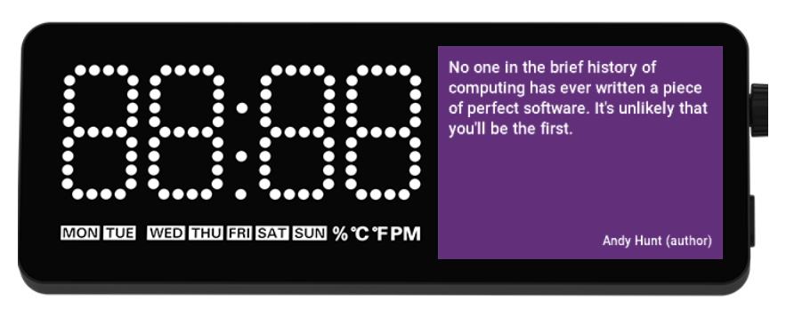

<h1>
    
    Programming Quotes
</h1>

This is an app that displays ramdom programming quotes from [https://programming-quotes-api-pi.vercel.app](https://programming-quotes-api-pi.vercel.app) on [Vobot Mini Dock](https://getvobot.com/mini-dock).

## Installation

1. Create a new directory `programming-quotes` inside the `apps` directory of your Mini Dock.
2. Copy everything under `src` directory into this `programming-quotes` directory created on your Mini Dock.
3. Restart your Vobot Mini Dock.

For more details, please read [https://github.com/myvobot/dock-mini-apps/blob/main/README.md](https://github.com/myvobot/dock-mini-apps/blob/main/README.md)

## Development

Please visit [Mini Dock Developer Quick Started](https://dock.myvobot.com/developer/getting_started/) for guides on how to setup development environment.

### Folder Structure

- `/src`: Contains the source code of Vobot Mini Dock app. To get the app running on Vobot Mini Dock, upload this folder to your machine's `/app` folder. Visit [Mini Dock Developer Quick Started](https://dock.myvobot.com/developer/getting_started/) for guides on how to upload an app.
