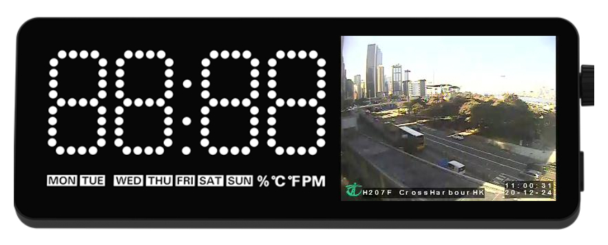

# Webcam app for Vobot Mini Dock

First, huge shout-out to [@ToBeHH](https://github.com/ToBeHH) for this great and [simple webcam app](https://github.com/ToBeHH/minidock_webcam/) we could fork and use on Vobot Mini Dock!

---

This is a sleek webcam application powered by the LVGL graphics library. You can configure up to 5 webcams in the vobot's application settings screen. This app provides a distraction-free interface for users to browse through user's configured webcams. With an encoder knob, users can effortlessly switch between different webcams, allowing them to watch different places of the earth in real time with ease.

Please note, that images cannot be scaled due to limited processing power. The URLs you provide must present a JPEG image (not MJPEG or any other format) in 320x240 pixels resolution.

> The traffic snapshot image used in the above preview screenshot is provided by [data.gov.hk](https://data.gov.hk/en-data/dataset/hk-td-tis_2-traffic-snapshot-images/resource/bb083610-4d4b-4883-8616-a488790945d3)

## Installation

1. Create a new directory `webcam` inside the `apps` directory of your Mini Dock.
2. Copy everything under `src` directory into this `webcam` directory created on your Mini Dock.
3. Restart your Vobot Mini Dock.

For more details, please read [https://github.com/myvobot/dock-mini-apps/blob/main/README.md](https://github.com/myvobot/dock-mini-apps/blob/main/README.md)

## Development

Please visit [Mini Dock Developer Quick Started](https://dock.myvobot.com/developer/getting_started/) for guides on how to setup development environment.
